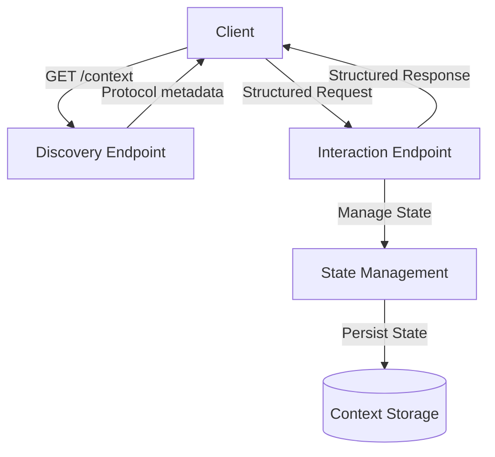

# Interactive Discovery Protocol (IDP)

**Interactive Discovery Protocol (IDP)** is a self-describing, auto-discoverable protocol designed for structured API interactions, explicit state management, and robust context handling.

## Project Structure

```
idp-specification/
├── README.md             # Introduction & overview
├── specification.md      # Detailed architectural specification
├── idp-schema.yaml       # OpenAPI schema definition
└── examples/
    └── usage_examples.md # Practical usage examples
```

## Key Features

- **Self-describing APIs**
- **Built-in state and context management**
- **Language-agnostic schema definitions**
- **Automation-friendly for clients and documentation**

## Protocol Flow Overview



## Getting Started

- Read [specification.md](./specification.md) for an in-depth understanding.
- Use [idp-schema.yaml](./idp-schema.yaml) with OpenAPI tooling to generate clients, validate schemas, or produce documentation.

