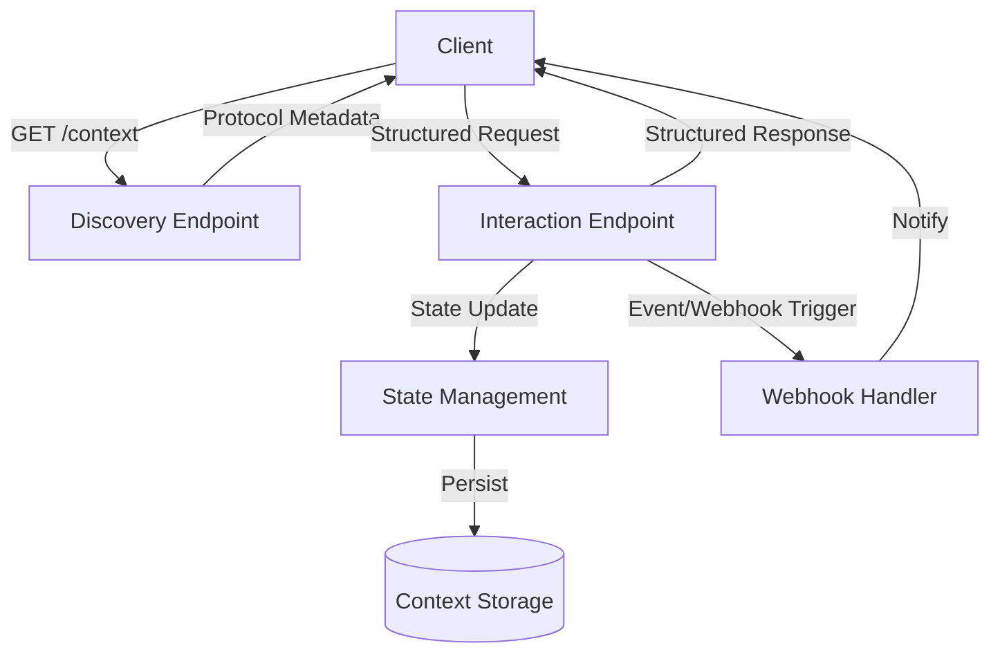

# Interactive Discovery Protocol (IDP)

**Interactive Discovery Protocol (IDP)** is a structured, self-describing protocol designed for robust API interactions, clear state management, and comprehensive context handling. The IDP standard provides schemas, patterns, and clear guidelines for API auto-discovery, security, and extensibility.

**Maintained by [copyleftdev](https://github.com/copyleftdev)**

---

## Project Structure

```
idp-specification/
├── README.md                # Introduction & overview
├── specification.md         # Architectural specification
├── idp-schema.yaml          # Protocol schema (OpenAPI)
├── examples/
│   └── usage_examples.md    # Usage examples
└── .github/
    └── workflows/
        └── sdk-gen.yaml     # SDK automation workflows
```

---

## Key Features

- **Self-describing API endpoints**
- **Built-in state and context management**
- **Schema-oriented design** (OpenAPI)
- **Explicit authentication and security practices**
- **Standardized error handling**
- **Webhook and event-driven integration**
- **Automated SDK generation**

---

## Protocol Flow Overview



---

## Getting Started

### Retrieve Protocol Specification
```bash
curl -X GET "https://api.example.com/context"
```

### Example Response
```json
{
  "protocol": "IDP",
  "version": "1.0.0",
  "endpoints": {...},
  "context_management": {...},
  "security": {...}
}
```

For full details, see:

- **Architectural Specification**: [`specification.md`](./specification.md)
- **Protocol Schema (OpenAPI)**: [`idp-schema.yaml`](./idp-schema.yaml)
- **Practical Examples**: [`examples/usage_examples.md`](./examples/usage_examples.md)

---

## Contributing

Contributions and feedback are welcome. Please open issues, submit pull requests, or reach out directly to [copyleftdev](https://github.com/copyleftdev).

---

## License

Licensed under the [MIT License](LICENSE).
