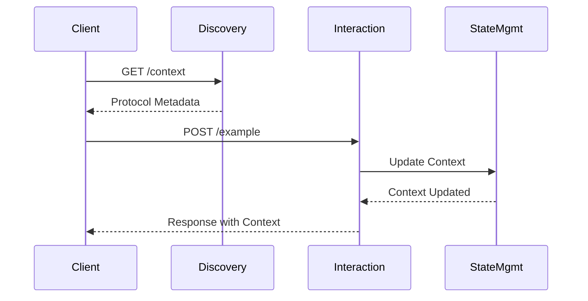

# Interactive Discovery Protocol (IDP) – Usage Examples

Practical examples illustrating how clients interact with the IDP.

---

## Retrieve Protocol Context

Clients first discover available endpoints, schemas, and operations using the `/context` endpoint.

### Request

```bash
curl -X GET "https://api.example.com/context"
```

### Response Example

```json
{
  "protocol": "IDP",
  "version": "1.0.0",
  "endpoints": {
    "/example": {
      "method": "POST",
      "description": "Demonstration interaction endpoint",
      "request_schema": { "type": "object" },
      "response_schema": { "type": "object" },
      "examples": {
        "curl": "curl -X POST https://api.example.com/example -d '{\"key\":\"value\"}'"
      }
    }
  },
  "context_management": {
    "session_timeout": 3600,
    "operations": ["create", "retrieve", "update", "expire"]
  }
}
```

---

## Example Endpoint Interaction

Here's how a structured interaction with an IDP endpoint looks:

### Request

```bash
curl -X POST https://api.example.com/example \
  -H "Content-Type: application/json" \
  -d '{"key":"value"}'
```

### Response Example

```json
{
  "status": "success",
  "context": {
    "session_id": "abc123",
    "expires_in": 3600
  },
  "data": {
    "example_response": "value"
  }
}
```

---

## Interaction Sequence

