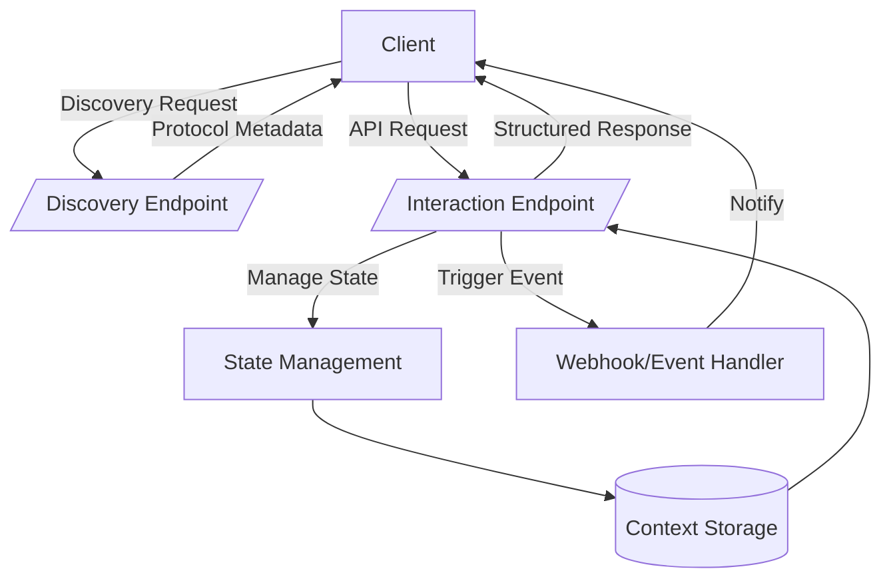
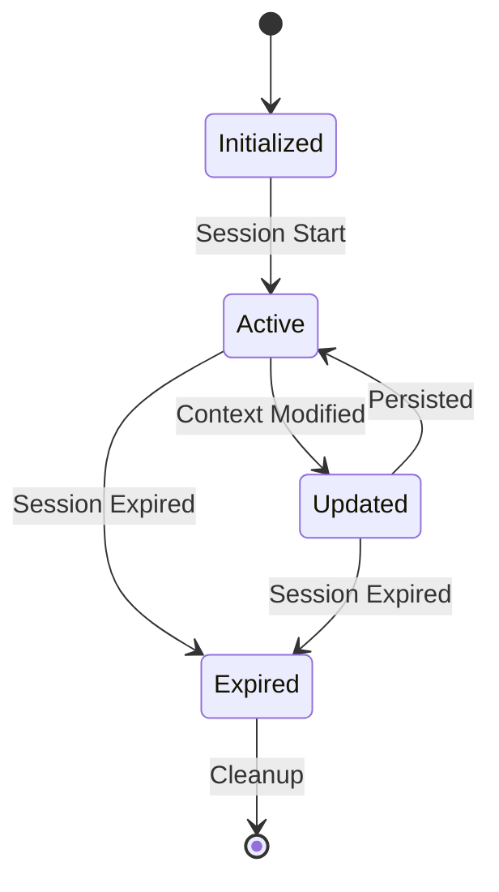
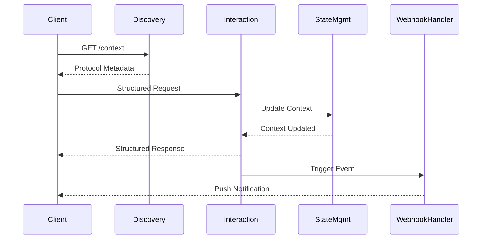

# Interactive Discovery Protocol (IDP) – Architectural Specification

**Version:** 1.0.0  
**Maintainer:** [copyleftdev](https://github.com/copyleftdev)  
**License:** MIT  

---

## Overview

The **Interactive Discovery Protocol (IDP)** is a schema-driven, language-agnostic protocol designed for explicit state management, comprehensive context tracking, and secure, structured API interactions. IDP defines clear interaction patterns, lifecycle events, and security guidelines.

---

## Architectural Components



---

## State & Context Lifecycle



---

## Interaction Patterns

Typical interaction flow between clients and IDP endpoints:



---

## Error Handling

All errors follow standardized JSON schema responses:

```json
{
  "error_code": "InvalidRequest",
  "error_message": "Detailed error description."
}
```

---

## Security & Authentication

IDP implementations require:

- **TLS** for all interactions.
- **Bearer Token Authentication** (JWT recommended).
- **Rate limiting** and input validation (OWASP API Security Guidelines).

---

## Versioning Strategy

IDP follows Semantic Versioning (`MAJOR.MINOR.PATCH`):

- **Major**: Breaking changes  
- **Minor**: Backward-compatible additions  
- **Patch**: Bug fixes or minor improvements  

Clients identify supported versions through `/context`.

---

## Observability & Logging

Implementations must support observability best practices:

- Structured logging (JSON format recommended)
- Standardized metrics (OpenTelemetry)

---

## Internationalization (i18n)

All user-facing messages should support localization:

```json
{
  "en": "Operation successful.",
  "es": "Operación exitosa."
}
```

---

## Schema Definition

Complete schema definitions available in [`idp-schema.yaml`](./idp-schema.yaml), following OpenAPI v3.1 standards.

---

## Contribution Guidelines

Contributions and feedback are encouraged. Submit pull requests or issues via the [official repository](https://github.com/copyleftdev).
