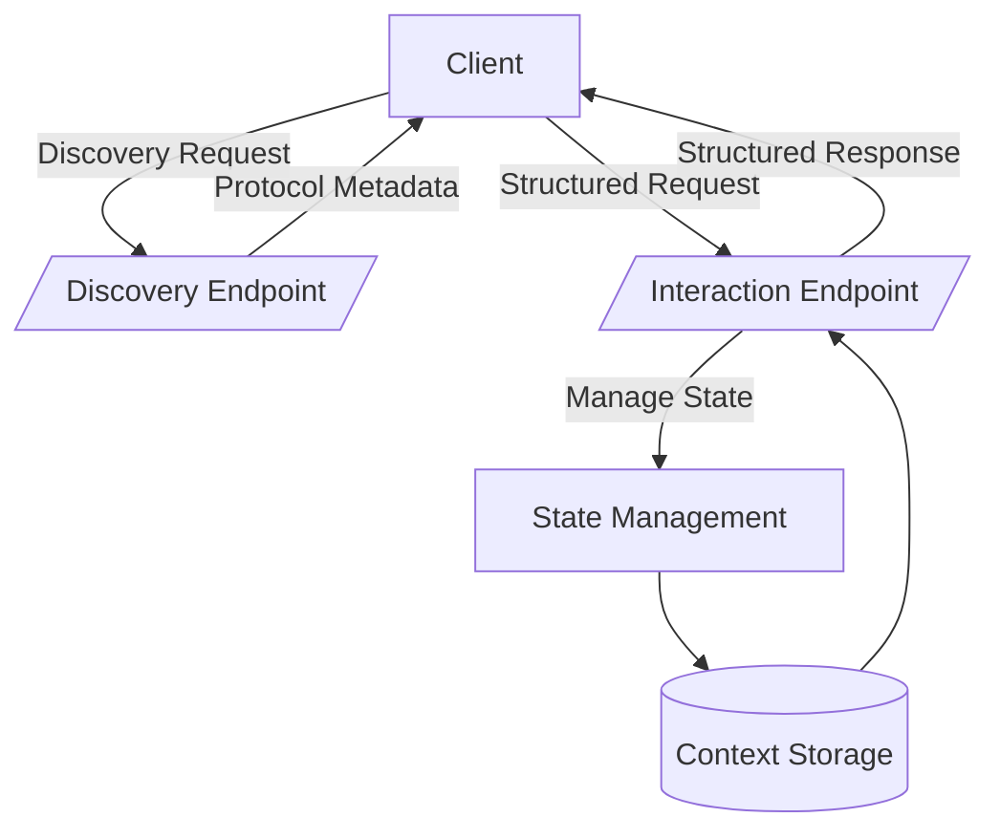
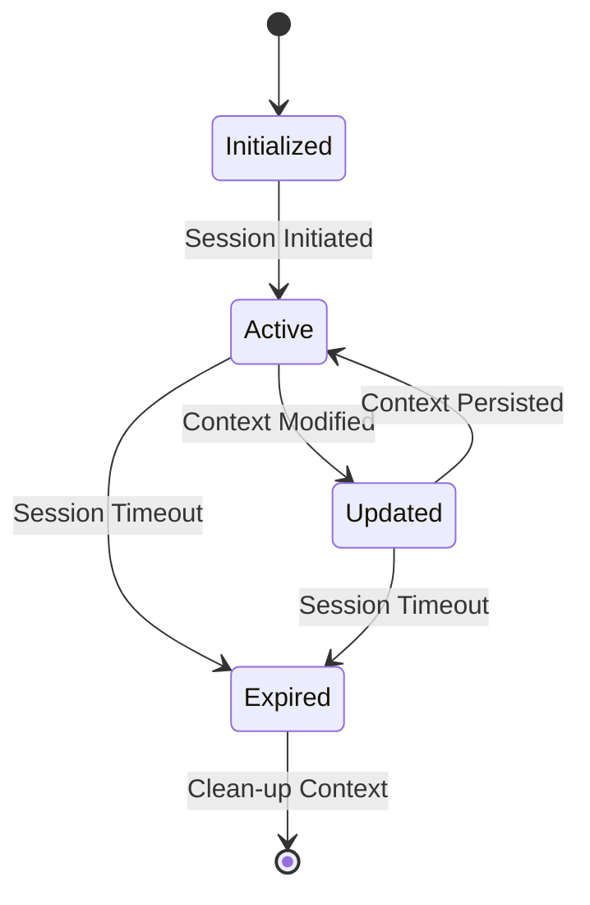
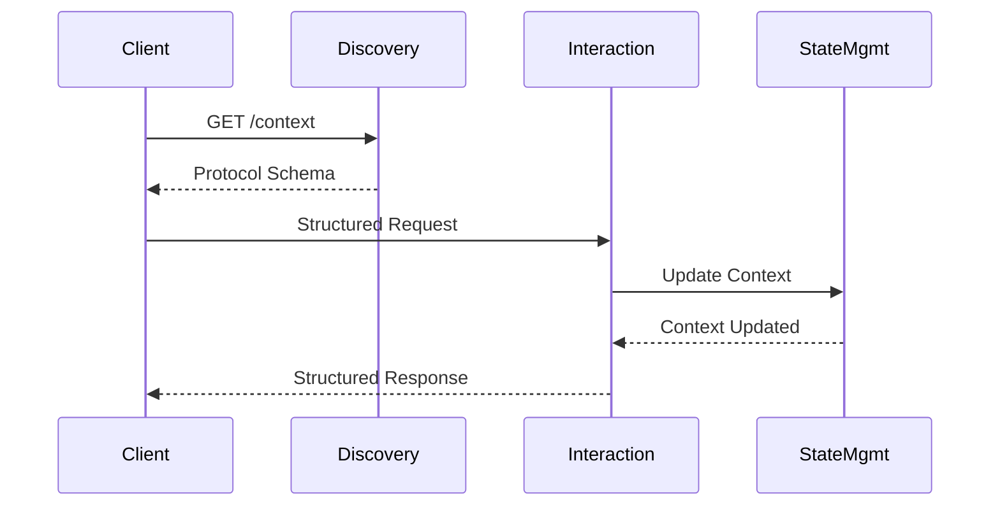

# Interactive Discovery Protocol (IDP) – Architectural Specification

**Version:** 1.0.0  
**Author:** Don Johnson 
**License:** MIT  

---

## Overview

The **Interactive Discovery Protocol (IDP)** defines a self-describing, structured API interaction framework designed explicitly for clear context handling and robust state management. This document outlines IDP’s architecture, state management concepts, interaction patterns, and schema structure.

---

## Architectural Components

---

## State & Context Lifecycle

The lifecycle clearly defines the state transitions within IDP.

---

## Interaction Patterns

Typical interaction flows between clients and IDP endpoints:

---

## Schema Definition

The schema is detailed in [`idp-schema.yaml`](./idp-schema.yaml), following OpenAPI v3.1 standards, enabling automated tooling and client generation.
